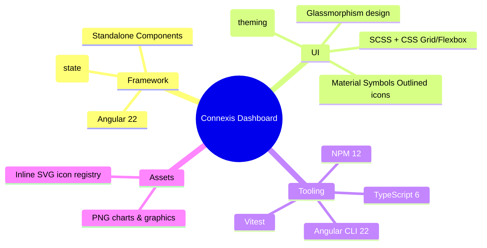
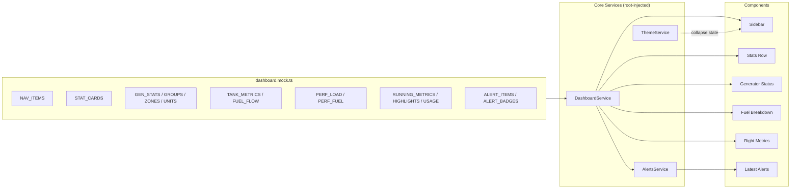
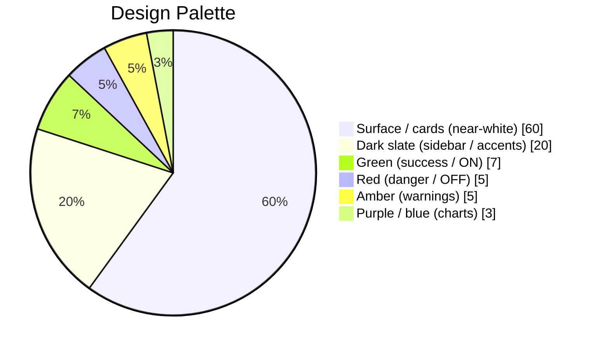
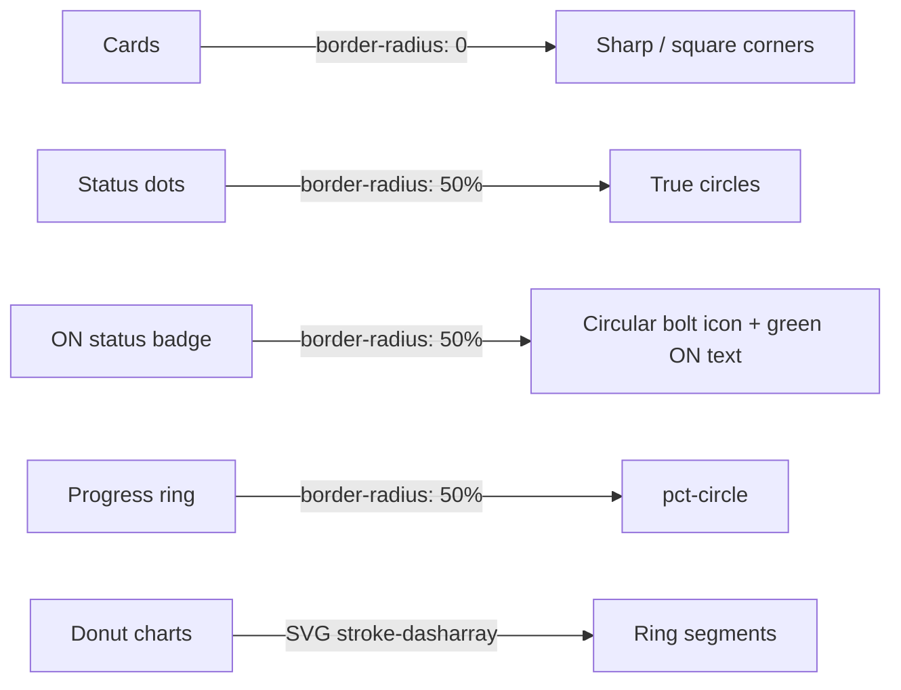

# CONNEXIS — Generator Monitoring Dashboard

> **Project Information** — Everything you need to know about the application at a glance.

---

## 1. What Is This Project?

**Connexis Dashboard** is a modern, responsive **generator monitoring dashboard** built with **Angular 22**. It gives plant operators a real-time, at-a-glance view of a fleet of diesel generators — fuel levels, load factors, running hours, weather, alerts and weekly performance — all inside a single glassmorphism-styled screen.

The dashboard is a **front-end only** prototype: every value you see is sourced from local mock data and rendered through typed Angular models. No backend API is required to run it.

---

## 2. Key Features

| Feature | Description |
|---|---|
| 🧭 **Navigation Sidebar** | Icon-based nav (Material Symbols Outlined) for Dashboard, Reports, Alarms, Monitoring, Outage and Help. Collapses on mobile into a drawer. |
| 📊 **Stats Row** | 6 summary tiles — Total Generators, ON, OFF, Total Filling, Fuel Used, Fuel Depletion. |
| ⚡ **Generator Status** | Selected generator graphic, ON/OFF status badge (circular bolt icon), group/zone/unit dropdowns and per-generator stats (Power, Usage Hours, Last Start). |
| ⛽ **Fuel Breakdown** | Tank Opening/Closing/Size/Depletion cards plus Fuel Filled vs Fuel Consumed flow cards. |
| 🍩 **Performance Panel** | Two donut charts (Load vs Capacity, Fuel Usage) for the past week. |
| 📈 **Right Metrics** | Running hours, ambient temperature, load factor, weather (Lahore), monthly highlights and total usage. |
| 🔔 **Latest Alerts** | Scrollable alert feed with severity dots and a **View More / View Less** toggle that scrolls *inside* the card. |
| 🏷️ **Alert Badges** | Critical / Minor / Normal / Upcoming Maintenance counters. |
| 📱 **Fully Responsive** | Desktop 3-column grid → tablet stacked reorder → mobile single column with drawer. |

---

## 3. Tech Stack



| Layer | Technology |
|---|---|
| Framework | Angular 22 (standalone components, `ChangeDetectionStrategy.OnPush`) |
| Language | TypeScript ~6.0 |
| State | Angular **signals** (`signal`, `computed`) — no NgRx needed |
| Styling | SCSS — CSS Grid + Flexbox, Material 3 theming (`mat.theme()`) |
| Icons | Google **Material Symbols Outlined** via `<link>` + `<span>` method |
| Component library | Angular Material 22 (`@angular/material`, `@angular/cdk`) |
| Routing | Lazy-loaded standalone routes with `router-outlet` |
| Testing | Vitest + jsdom |
| Package manager | npm 12 |

---

## 4. Project Structure

```
connexis-dashboard/
├── public/
│   └── assets/               # PNG charts, logos, QR code, store badges
├── src/
│   ├── index.html            # Entry HTML + Google Fonts / Material Symbols links
│   ├── main.ts               # Bootstrap (bootstrapApplication)
│   ├── styles.scss           # Global reset, Material theme, shell, desktop zoom
│   └── app/
│       ├── app.component.*   # Shell root (sidebar + scrim + router-outlet)
│       ├── app.config.ts     # DI providers (router, animations, http, error listener)
│       ├── app.routes.ts     # Lazy route table
│       ├── core/
│       │   ├── models/       # Typed domain models
│       │   ├── services/     # Dashboard / Alerts / Theme signal services
│       │   ├── guards/       # auth.guard
│       │   └── interceptors/ # http-error.interceptor
│       ├── layout/
│       │   ├── main-layout/  # Header + <router-outlet> shell
│       │   ├── header/       # Topbar: hamburger + bank selector
│       │   └── sidebar/      # Left nav rail + store badges + QR
│       ├── features/
│       │   ├── dashboards/   # The main dashboard page
│       │   │   ├── data/dashboard.mock.ts   # ALL display literals
│       │   │   └── components/              # stats-row, generator-status,
│       │   │       ├── fuel-breakdown/      # fuel-breakdown, performance-panel,
│       │   │       ├── right-metrics/       # right-metrics, latest-alerts,
│       │   │       ├── latest-alerts/       # alert-badges
│       │   │       ├── generator-status/
│       │   │       ├── alert-badges/
│       │   │       ├── stats-row/
│       │   │       └── performance-panel/
│       │   ├── reports/      # Placeholder feature pages
│       │   ├── alarms/
│       │   ├── monitoring/
│       │   ├── outage/
│       │   └── help/
│       ├── shared/
│       │   ├── components/   # card, badge, select, icon, donut-chart,
│       │   │                 # feature-placeholder, qr-code
│       │   ├── directives/   # click-outside
│       │   └── pipes/        # kva pipe
│       └── styles/           # _tokens, _typography, _mixins (SCSS partials)
└── ProjectInformation.md     # This file
└── ProjectSystemDesign.md    # Deep system design document
```

---

## 5. Core Domain Models

```mermaid
classDiagram
    class NavItem {
        +string symbol
        +string label
        +string route
    }
    class StatCard {
        +string cardClass
        +string title
        +string value
        +valueClass
        +StatIcon icon
    }
    class StatIcon {
        <<union>>
        +type: 'icon' | 'img' | 'pct'
    }
    class GenStat {
        +IconName icon
        +string imageUrl?
        +string label
        +string sub
        +string value
        +boolean blue?
        +boolean tinted?
    }
    class TankMetric {
        +string title
        +string sub?
        +string value
        +boolean red?
        +string imageUrl
    }
    class FuelFlow {
        +string title
        +string sub
        +string value
        +string imageUrl
    }
    class PerformanceChart {
        +variant: 'd1' | 'd2'
        +DonutSegment[] segments
        +string[] centerLines
        +DonutPercent[] percentLabels
        +string value
        +string valueSmall
    }
    class AlertItem {
        +string dot
        +string title
        +string sub
        +string time
        +boolean hidden
    }
    class AlertBadge {
        +variant: 'critical' | 'minor' | 'normal' | 'upcoming'
        +number count
        +string label
    }
```



All models live in `src/app/core/models/`:

| Model file | Defines |
|---|---|
| `generator.model.ts` | `IconName`, `GeneratorStatus`, `StatIcon`, `StatCard`, `GenStat` |
| `fuel.model.ts` | `TankMetric`, `FuelFlow`, `DonutSegment`, `DonutPercent` |
| `metric.model.ts` | `RunningMetric`, `HighlightCard`, `Weather`, `UsageSummary`, `PerformanceChart` |
| `alert.model.ts` | `AlertSeverity`, `AlertItem`, `AlertVariant`, `AlertBadge` |
| `nav-item.model.ts` | `NavItem`, `StoreBadge` |

---

## 6. Services & State



| Service | Responsibility |
|---|---|
| `DashboardService` | Exposes every dashboard data set as a **signal** — nav, stats, generators, fuel, performance, metrics, alerts. |
| `AlertsService` | Derives the visible alert list via `computed` and manages the **View More / View Less** expanded flag. |
| `ThemeService` | Holds `sidebarCollapsed` signal; `toggle` / `collapse` / `expand` map to the `body.side-collapsed` class. |

---

## 7. Routing Map

| Route | Component | Title | Lazy? |
|---|---|---|---|
| `/` | `DashboardComponent` | Dashboard | ✅ |
| `/reports` | `ReportsComponent` | Report | ✅ |
| `/alarms` | `AlarmsComponent` | Alarms | ✅ |
| `/monitoring` | `MonitoringComponent` | Monitoring | ✅ |
| `/outage` | `OutageComponent` | Outage | ✅ |
| `/help` | `HelpComponent` | Help | ✅ |

All routes are children of `MainLayoutComponent`, which renders the shared **header + router-outlet** shell. Non-dashboard pages use `FeaturePlaceholderComponent`.

---

## 8. Visual Design System

### Palette



| Token | Use |
|---|---|
| `#f2f1ef` (`--side`) | Main dashboard background (gray) |
| White → `#f8fbff` gradients | Card surfaces |
| `#111827 → #06080d` | Dark accents (ON badge, icon tiles) |
| `#35e01e` | Success green (ON status) |
| `#e53935` | Danger red (OFF / low fuel / hot weather) |
| `#f0a938` / `#fdd835` | Amber warnings |
| `#7c3aed`, `#2196f3` | Donut chart segments |
| `#0f6ea7` | FUEL BREAKDOWN heading accent |

### Shape Language



- **Cards, panels, buttons, dropdowns** — deliberately **square** (`border-radius: 0`) for the industrial/utility look.
- **Only true circles are rounded**: status dots, percentage rings, the ON-status bolt badge.
- **Icons** — Material Symbols Outlined loaded via Google Fonts (`<link>` + `<span class="material-symbols-outlined">`).

### Desktop Zoom Behaviour

At ≥1264px wide the app applies `html { zoom: 0.9 }`, baking the previously-preferred 90% browser-zoom appearance into the default 100% zoom. Below 1264px layouts use their own tuned sizes.

---

## 9. Responsive Breakpoints

| Width | Layout |
|---|---|
| ≥ 1264px | Full desktop: 3-column grid `252px / 1fr / 302px`, 90% zoom active, `height: 100vh` pinned |
| 1200 – 1263.98px | Desktop but no zoom, natural height |
| ≤ 1199.98px | **Tablet stack**: fuel → generator → right metrics, reordered with grid `order` |
| ≤ 639.98px | **Mobile**: single column, drawer sidebar, hamburger topbar, compact gaps |

---

## 10. Running the Project

```bash
# Install dependencies
npm install

# Start dev server → http://localhost:4200
ng serve

# Production build → dist/
ng build

# Unit tests (Vitest)
ng test
```

> ⚠️ **Note:** this project intentionally does **not** modify git hooks or global git config. Never commit secrets/keys.