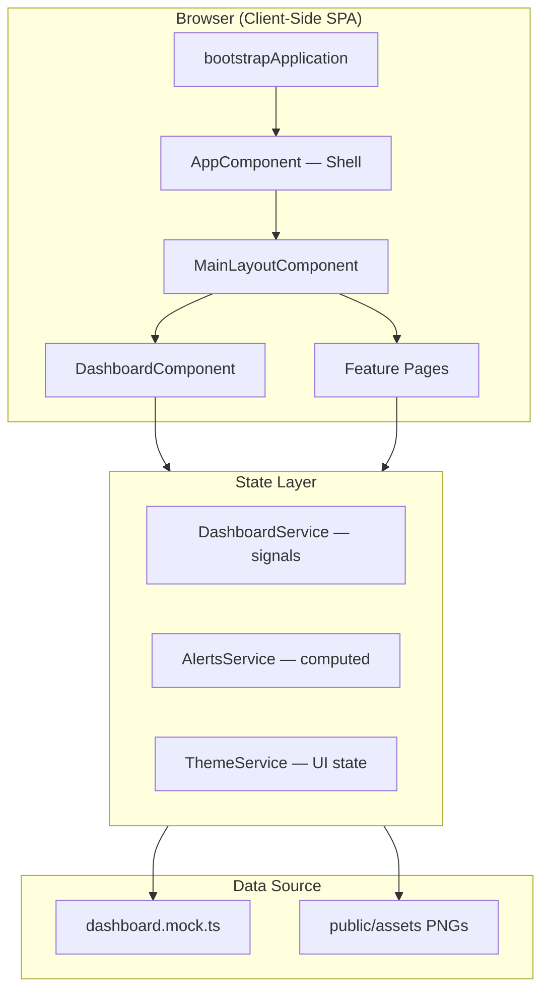
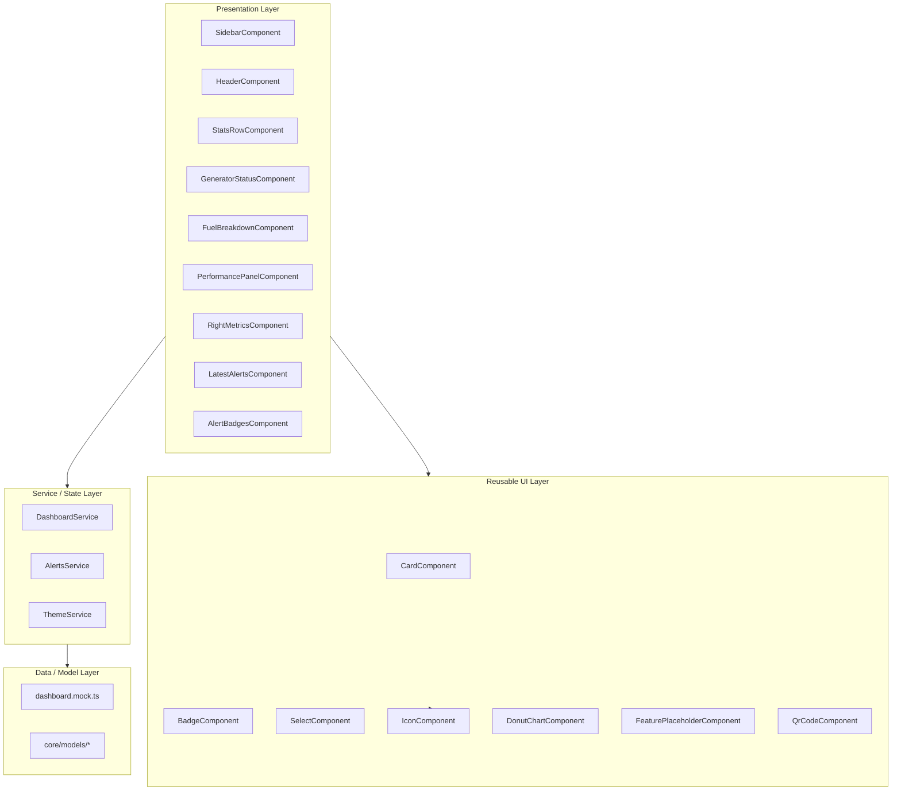
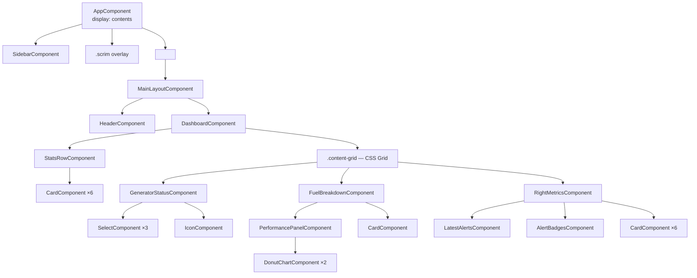
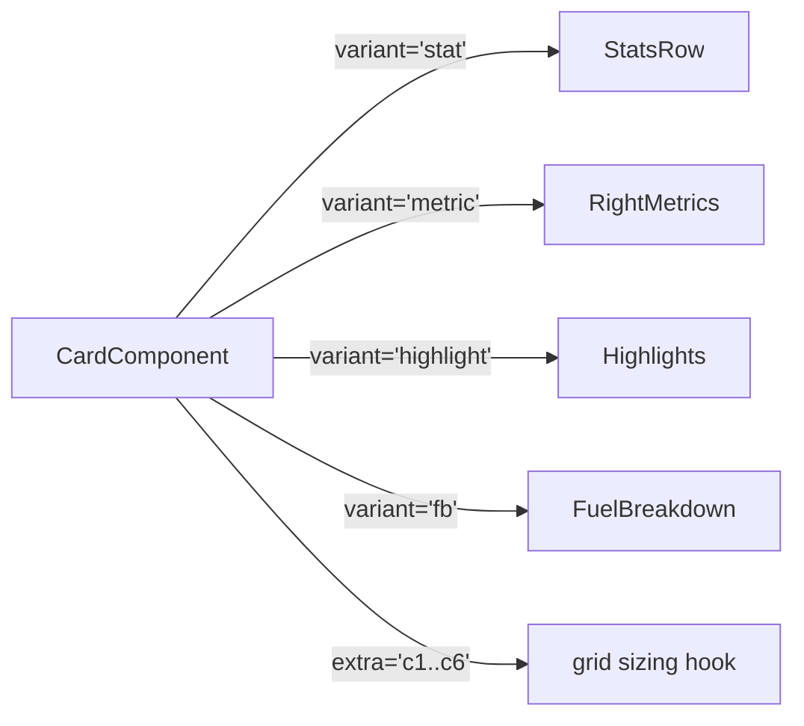
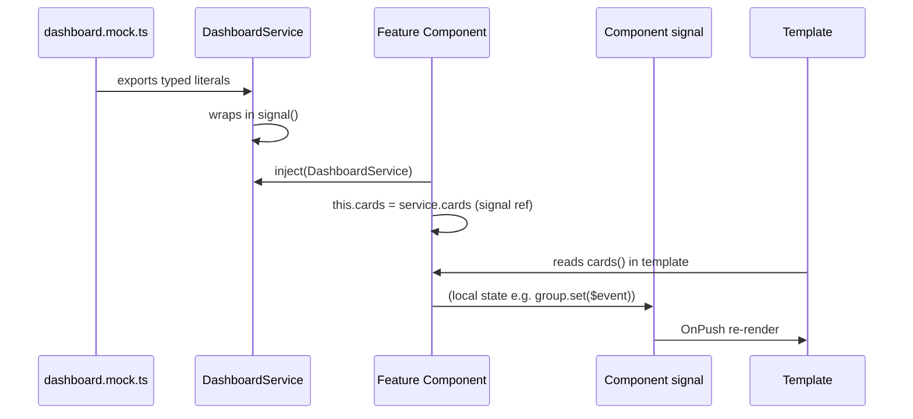
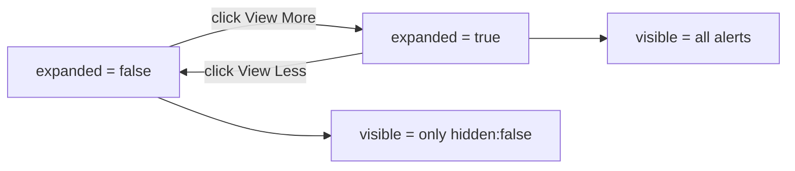
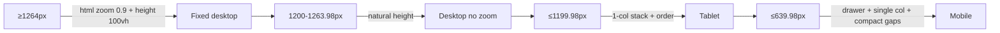
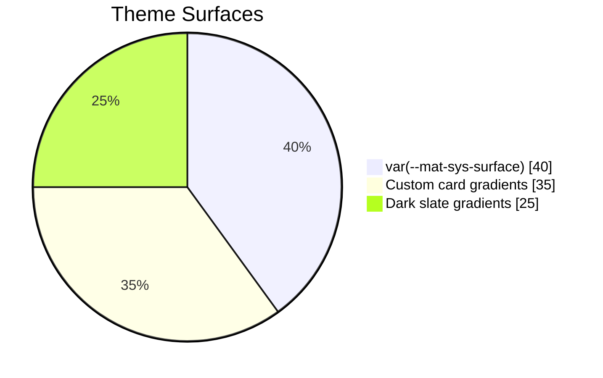
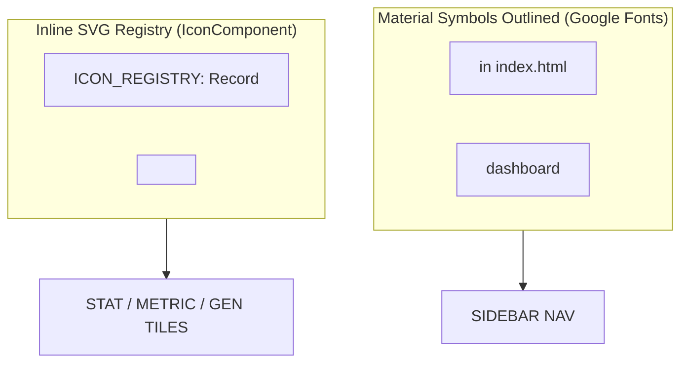
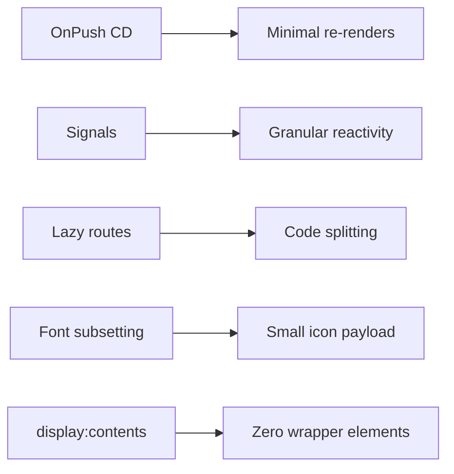

# CONNEXIS — System Design Document

> **Project System Design** — Architecture, component design, data flow, state management, layout system, styling architecture, responsive strategy, performance and extension points.

---

## Table of Contents

1. [System Overview](#1-system-overview)
2. [Architecture Layers](#2-architecture-layers)
3. [Component Architecture](#3-component-architecture)
4. [Data Flow & State Management](#4-data-flow--state-management)
5. [Layout System](#5-layout-system)
6. [Styling Architecture](#6-styling-architecture)
7. [Responsive Strategy](#7-responsive-strategy)
8. [Theming (Angular Material)](#8-theming-angular-material)
9. [Icon System](#9-icon-system)
10. [Performance Considerations](#10-performance-considerations)
11. [Extension Points](#11-extension-points)
12. [Constraints & Conventions](#12-constraints--conventions)

---

## 1. System Overview



The application is a **pure client-side Angular SPA**. There is **no backend API**; all data is hydrated from the typed mock module and pushed into signals. The system is built for eventual wiring to a real telemetry/SCADA backend — the service boundary already isolates the UI from the data source.

---

## 2. Architecture Layers



### Layer responsibilities

| Layer | Responsibility | Examples |
|---|---|---|
| **Presentation** | Page + feature-specific components; owns local UI signals | `DashboardComponent`, `GeneratorStatusComponent` |
| **Reusable UI** | Shared, stateless primitives with variant inputs | `Card`, `Select`, `Badge`, `DonutChart` |
| **Service / State** | Root-injected singletons owning application state as signals | `DashboardService`, `AlertsService`, `ThemeService` |
| **Data / Model** | Typed contracts + literal mock data | `dashboard.mock.ts`, `core/models/*` |

---

## 3. Component Architecture

### Component Tree



### Component design rules

- **Standalone components** — no `NgModule`s; every component imports exactly what it needs.
- **`ChangeDetectionStrategy.OnPush`** everywhere → renders only when an input/signal changes.
- **`ViewEncapsulation.None`** + `host { display: contents }` → the dashboard components become invisible layout wrappers so shared SCSS selectors (e.g. `.fuel-center`, `.right-col`) act on the real elements, matching the original source markup 1:1.
- **Shared primitives** receive *variant / configuration* inputs instead of hard-coded HTML:



### Shared components reference

| Component | Inputs | Purpose |
|---|---|---|
| `CardComponent` | `variant`, `extra?` | Generic card wrapper for stat / metric / highlight / fuel tiles |
| `BadgeComponent` | variant/severity | Colored pill/badge (e.g. alert severities) |
| `SelectComponent` | `options`, `big?` | Custom styled dropdown for Group / Zone / Unit |
| `IconComponent` | `name: IconName` | Inline-SVG registry (`ICON_REGISTRY`) used inside cards |
| `DonutChartComponent` | `variant`, `segments`, `centerLines`, `percentLabels` | SVG ring chart with center text |
| `FeaturePlaceholderComponent` | — | Stub UI for reports/alarms/monitoring/outage/help |

---

## 4. Data Flow & State Management

### One-Way Data Flow



### State inventory

| State | Owner | Kind |
|---|---|---|
| Nav items, stats, gens, fuel, perf, metrics, alerts, badges | `DashboardService` | `signal<T[]>` (read-only data) |
| Visible alerts + View More flag | `AlertsService` | `signal<bool>` + `computed<T[]>` |
| Selected group / zone / unit | `GeneratorStatusComponent` | local `signal<string>` |
| Sidebar collapsed | `ThemeService` | `signal<bool>` → `body.side-collapsed` |

### Alerts expansion design (View More / View Less)



The `AlertsService.visible` is a `computed()` that filters `hidden` items unless expanded. The panel uses a bounded flex layout (`grid-template-rows: 1fr`, `height: 100vh` pinned on desktop) so expanding the list **never pushes the page** — the list scrolls internally via `.alerts-list { overflow-y: auto }`.

---

## 5. Layout System

### Desktop Grid (≥ 1200px)

```text
┌───────────────┬──────────────────────────┬──────────────┐
│  SIDEBAR      │  HEADER (topbar)         │              │
│  195px        │  ┌──────────────────────┐│              │
│  ┌──────────┐ │  │ stats-row (6 tiles)  ││              │
│  │ logo     │ │  └──────────────────────┘│              │
│  ├──────────┤ │  ┌──────────────────────┐│  RIGHT COL   │
│  │ DASHBOARD│ │  │ Generator Status     ││  ┌────────┐  │
│  │ REPORT   │ │  ├──────────────────────┤│  │ metrics │  │
│  │ ALERMS   │ │  │ FUEL BREAKDOWN       ││  │ grid   │  │
│  │ MONITOR  │ │  │  + Performance       ││  ├────────┤  │
│  │ OUTAGE   │ │  └──────────────────────┘│  │ highl.  │  │
│  │ HELP     │ │                          │  ├────────┤  │
│  ├──────────┤ │                          │  │ usage   │  │
│  │ stores   │ │                          │  ├────────┤  │
│  │ QR       │ │                          │  │ alerts  │  │
│  └──────────┘ │                          │  └────────┘  │
└───────────────┴──────────────────────────┴──────────────┘
```

**Desktop grid definition** (`dashboard.component.scss`):

```scss
.content-grid {
  display: grid;
  grid-template-columns: 252px minmax(0, 1fr) 302px;
  grid-template-rows: 1fr;      /* row never grows with content */
  gap: 14px;
  align-items: stretch;
}
```

- Left column `252px` — Generator Status
- Center `minmax(0, 1fr)` — Fuel Breakdown + Performance Panel
- Right column `302px` — Metrics, Highlights, Usage, Alerts

### Column stacking (tablet ≤ 1199.98px)

```scss
@media (max-width: 1199.98px) {
  .content-grid { grid-template-columns: minmax(0, 1fr); }
  .fuel-center    { order: 1; }
  .gen-status     { order: 2; }
  .right-col      { order: 3; }
}
```

```text
┌──────────────────────┐
│ FUEL BREAKDOWN       │  order: 1
├──────────────────────┤
│ GENERATOR STATUS     │  order: 2
├──────────────────────┤
│ METRICS + HIGHLIGHTS │  order: 3
├──────────────────────┤
│ LATEST ALERTS        │
└──────────────────────┘
```

### Generator status responsive inner grid

```scss
.gen-body {
  display: grid;
  grid-template-areas: 'img pill' 'sel1 st1' 'sel2 st2' 'sel3 st3';
}
```

| Area | Element |
|---|---|
| `img` | Generator graphic |
| `pill` | ON status badge (circular bolt + green "ON") |
| `sel1..sel3` | Group / Zone / Unit dropdowns |
| `st1..st3` | Power / Usage Hours / Last Start stats |

On mobile (≤ 639.98px) this collapses to a single column: `img → pill → sel1 → st1 → …`.

---

## 6. Styling Architecture

### SCSS partials (`src/app/styles/`)

```mermaid
flowchart LR
    TOKENS[_tokens.scss] --> GLOBAL[styles.scss]
    TYPO[_typography.scss] --> GLOBAL
    MIXINS[_mixins.scss] --> GLOBAL
    GLOBAL --> MAT[mat.theme() block]
    GLOBAL --> COMPONENTS[Component SCSS files]
```

| Partial | Contents |
|---|---|
| `_tokens.scss` | CSS custom properties — `--side`, `--txt`, colors |
| `_typography.scss` | Font stacks, title/value sizing conventions |
| `_mixins.scss` | Reusable SCSS helpers mirroring source rules |

### Distribution model

- **Global + shell styles** live in `styles.scss` (reset, body background, `.app`, zoom).
- **Component-specific layout** lives in each component's SCSS, using `ViewEncapsulation.None` so selectors match the real DOM elements.
- **`display: contents` hosts** mean a component like `GeneratorStatusComponent` contributes its styles globally under `.gen-status`, `.on-pill`, etc., while emitting zero wrapper elements.

### Shape & shadow conventions

```text
Cards:      border-radius 0 · 1px border rgba(15,23,42,.05-.06)
            · shadow 0 8-12px 18-30px rgba(15,23,42,.06-.12)
Circles:    status dots · pct-circle · ON bolt badge (50%)
Bars:       usage bar SVG · fuel bar chart SVG
Headers:    panel-head / center-head / perf-head with bottom border
            + soft -8px -12px margin bleed to card edges
```

---

## 7. Responsive Strategy



| Breakpoint | Key rules |
|---|---|
| ≥ 1264px | `html { zoom: 0.9 }`, `.app { height: 100vh }` — baked 90% zoom look, pinned height |
| ≤ 1199.98px | `.content-grid` → single column; `order` reorders fuel → gen → metrics |
| ≤ 639.98px | `.main` padding 10/8/12, gaps 10px; drawer sidebar; bank-select shows logo only; alerts/on-pill reflow |
| Everywhere | `body { overflow-x: hidden }`, `min-width: 0` on flex/grid children to prevent blow-out |

---

## 8. Theming (Angular Material)

Material 3 theming is configured in `styles.scss`:

```scss
@use '@angular/material' as mat;

html {
  height: 100%;
  @include mat.theme((
    color: (primary: mat.$azure-palette, tertiary: mat.$blue-palette),
    typography: Roboto,
    density: 0,
  ));
}
```



> The Material theme provides system CSS variables (`--mat-sys-*`) for any Material component. The custom glassmorphism card styles override the default Material surfaces for the dashboard chrome.

---

## 9. Icon System

### Two icon sources



### Nav icons (Material Symbols Outlined)

| Nav item | Symbol |
|---|---|
| DASHBOARD | `dashboard` |
| REPORT | `description` |
| ALERMS | `notifications` |
| MONITORING | `monitor` |
| OUTAGE | `bolt` |
| HELP | `help` |

Loaded via:

```html
<link href="https://fonts.googleapis.com/css2?family=Material+Symbols+Outlined:wght@100&icon_names=dashboard,description,notifications,monitor,bolt,help" rel="stylesheet">
```

The `icon_names=` query param **subsets the font** so only the 6 needed glyphs download.

---

## 10. Performance Considerations



- **OnPush + signals** — only changed consumers re-render; `computed()` values are memoized.
- **Lazy-loaded routes** — reports/alarms/monitoring/outage/help split into separate chunks.
- **Font subsetting** — Material Symbols loads only the 6 nav glyphs.
- **Inline SVG registry** — dashboard tiles use hand-sized SVG, no extra HTTP requests.
- **Pinned desktop height** — `height: 100vh` + internal `.alerts-list` scroll avoids full-page reflow when the alert feed expands.

---

## 11. Extension Points

| Want to… | Do this |
|---|---|
| Add a nav entry | Add an object to `NAV_ITEMS` + a route in `app.routes.ts` |
| Change dashboard data | Edit `dashboard.mock.ts` (typed by models) |
| Swap mock for a real API | Replace signal initialisation in `DashboardService` with `http.get()` / `rxResource` — UI untouched |
| Add a chart type | Extend `DonutChartComponent` variant union + registry |
| Add a new stat tile | Append to `STAT_CARDS` with a `StatIcon` |
| New shared primitive | Create under `shared/components/` following the Card/Select pattern |
| Re-theme | Adjust `mat.theme()` tokens + `_tokens.scss` custom properties |
| Add a nav icon | Add to `icon_names=` in the index.html font link + `NavItem.symbol` |

---

## 12. Constraints & Conventions

### Must-keep conventions

1. **Every display string lives in `dashboard.mock.ts`** — components never hard-code labels.
2. **Typed models first** — all mock data is typed against `core/models`.
3. **Signals for all reactive state** — no subjects/BehaviorSubjects in new code.
4. **Standalone components only** — no NgModules.
5. **`ViewEncapsulation.None`** + `display: contents` for feature components that own layout selectors.
6. **Sharp corners on cards, circles only on true circles.**
7. **No comments in code unless asked; no secrets in the repo.**

### Acceptance checks

- No horizontal overflow from 320px → 1920px.
- No vertical page scroll at desktop 1366×768 (dashboard fits one screen).
- Alerts View More must scroll inside the card, not push the page.
- All Material icon glyphs must render (font family `Material Symbols Outlined`).
- `npm run build` must pass cleanly.

---

*Documentation generated for the Connexis Generator Monitoring Dashboard (Angular 22).*